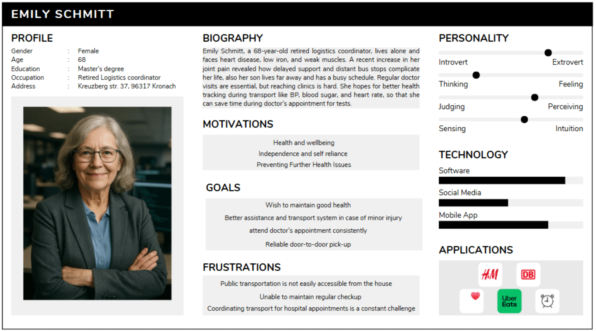
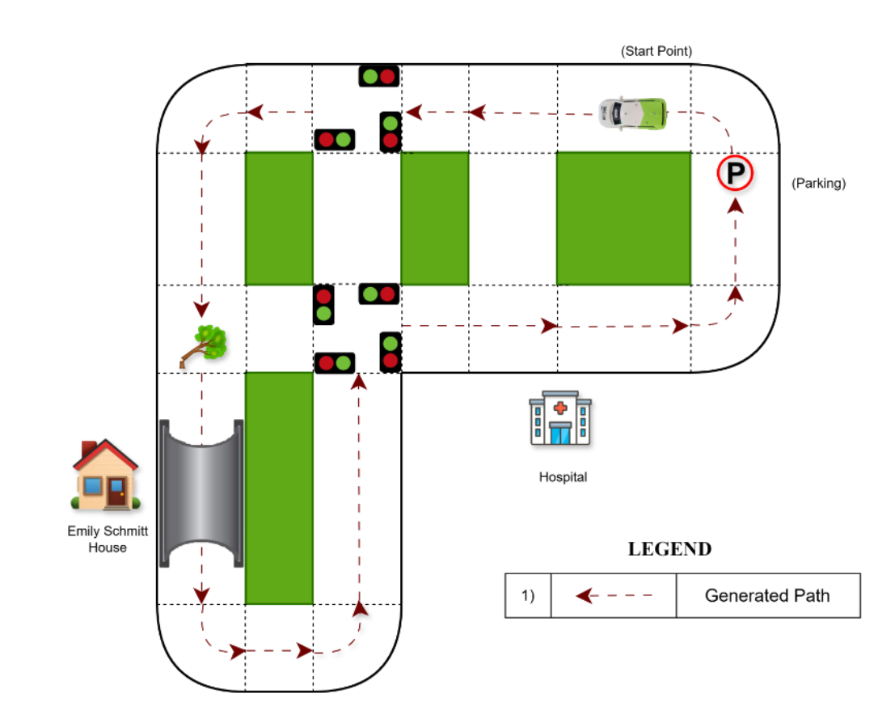
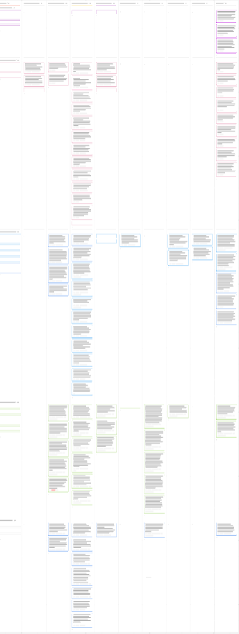
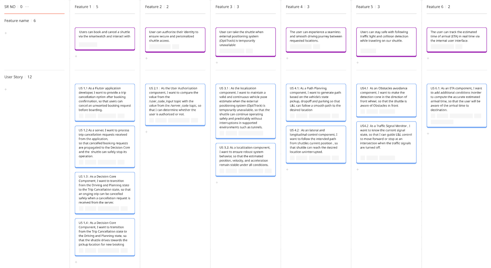
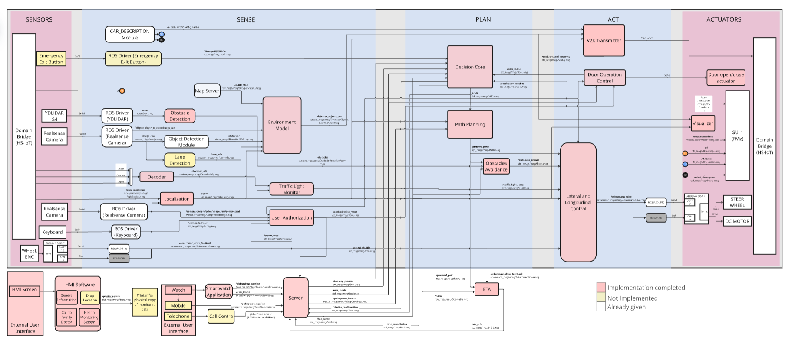
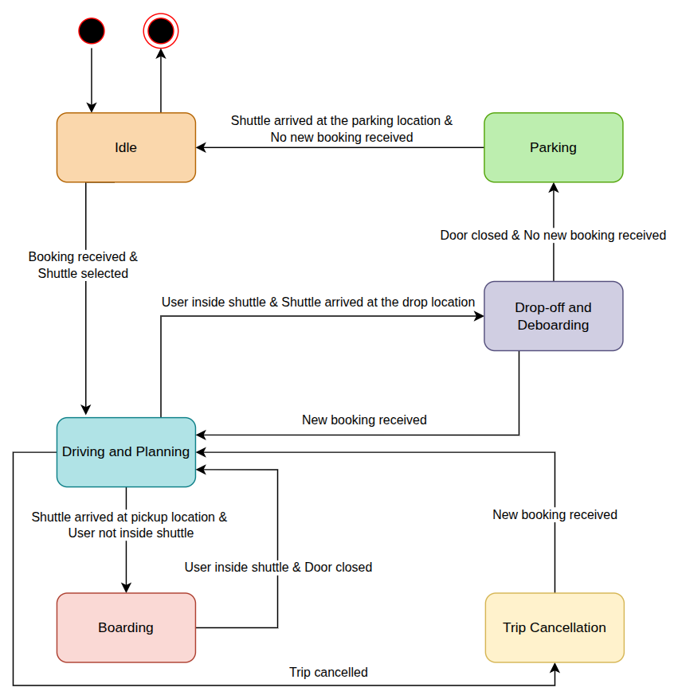
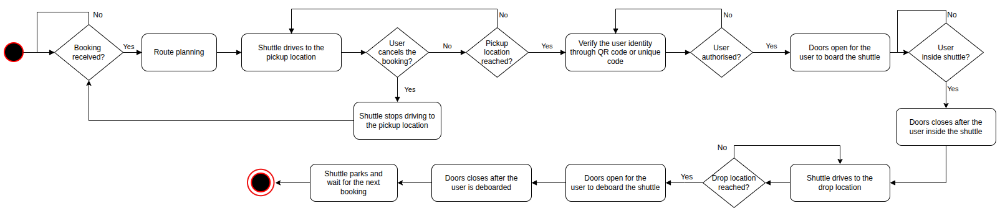
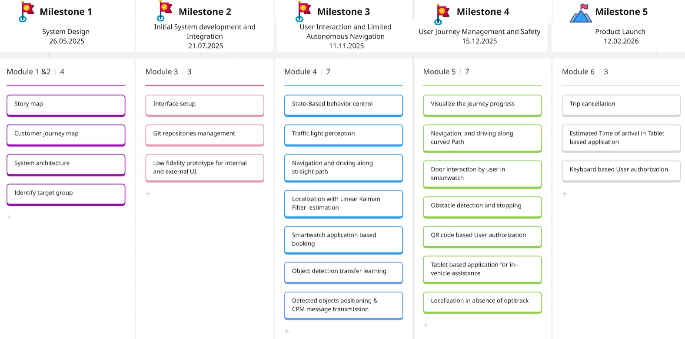

## Introduction
Empowering Independence through Autonomy- Pax Auto, a team of six passionate innovators, is developing an autonomous medical shuttle aimed at assisting elderly users in situations involving minor injuries. Our goal is to design a safe, reliable, and user-friendly mobility solution.

This repository contains all relevant project components, including the project definition, system architecture, and project management documentation. It also serves as a centralized resource for ongoing development, showcasing our progress, implementation strategies, and future plans.


## 📚 Contents
- [Project Definition](#-project-definition)
  - [Question 0](#question-0)
  - [Stakeholder map](#stakeholder-map)
  - [Persona](#persona)
  - [Use Case](#use-case)
  - [Scenario](#scenario)
  - [Customer Journey Map](#customer-journey-map)
  - [Story Map](#story-map)
  - [Features](#features)
- [System Architecture](#-system-architecture)
  - [Block Diagram](#block-diagram)
  - [State Diagram](#state-diagram)
  - [Activity Diagram](#activity-diagram)
- [Project Management](#-project-management)
  - [Processes](#processes)
  - [Tools](#tools)
  - [Milestones](#milestones)
- [Installation](#-installation)
- [Usage](#-usage)
- [License](#-license)


## 📘 Project Definition

### Question 0
Question 0 refers to the core problem or main challenge a product, service, or project aims to solve. It helps teams stay focused on the real purpose behind their work. By answering Question 0 clearly, all decisions can align with solving the right problem. 

How can we support elderly residents **`[for whom]`** in case of minor injuries **`[what for/why]`** in the district
of Kronach **`[where]`** by providing a rapid, non-emergency transport to hospitals and assistance **`[what]`**
through a subscription-based Autonomous Medical Shuttle **`[how]`**?

### Stakeholder map
A stakeholder map is a visual tool that identifies all the people or groups affected by a project, showing their level of interest and influence. It helps prioritize who to engage with and how to communicate effectively, making project planning and decision-making more focused and efficient. 

Being a development team, we are playing the role of internal stakeholders as designers and developers by
maintaining the composure between internal, external and public stakeholders.

<div align="center">
  
</div>


### Persona
The persona profile presents Emily Schmitt, a 68-year-old retired logistics coordinator, who lives independently and is managing multiple age-related health conditions. She faces issues such as heart disease, low iron, weak muscles, and occasional joint pain, which make regular mobility and access to public transportation more difficult. Her situation is further complicated by the distance to nearby bus stops and her need for consistent medical checkups.

Emily values health and well-being, along with independence and self-reliance. She is motivated by the desire to prevent further health complications and manage her existing conditions effectively. She hopes to benefit from improved health tracking and access to clinics, especially during transportation, to monitor metrics like blood pressure, heart rate, and blood sugar.bHer goals include staying in good health, receiving timely assistance in case of minor injuries, and consistently attending doctor appointments. A reliable, door-to-door transport service is essential to her lifestyle, as she no longer drives and public transit is difficult to use regularly due to accessibility challenges.

However, Emily is frustrated by how inaccessible public transportation is from her home. She finds it hard to maintain a regular medical schedule and experiences difficulty coordinating transport to and from hospitals, which often leads to missed or delayed appointments. In terms of personality, Emily is balanced more introverted than extroverted, with a tendency toward feeling and perceiving rather than strict logic or structure. She prefers intuitive approaches and adapts easily. When it comes to technology, she is comfortable using software and mobile apps but engages less with social media platforms.

Emily uses several apps like Uber Eats and messaging services to support her daily needs, though her use of entertainment or retail apps like H\&M and DB is limited. Her persona highlights the need for simple, reliable, and accessible health-focused mobility services tailored for aging users living independently.

<div align="center">
  
</div>

### Use Case
Emily Schmitt is a 68-year-old retired logistics coordinator living alone in Kreuzberg Str. 37, Kronach. She suffers from chronic health issues like heart disease, low iron, and weak muscles. Regular visits to the doctor are critical for her well-being, but unreliable and distant public transportation makes it increasingly difficult to attend appointments especially in cases of minor injuries or sudden pain flare-ups. With her son living far away and no daily caretaker, Emily struggles to coordinate transportation, often missing or delaying important medical checkups. 

To address this challenge, a subscription-based Autonomous Medical Shuttle is introduced in the Kronach district, designed specifically for elderly residents like Emily. This non-emergency service provides rapid, reliable, and safe transport to hospitals and clinics right from the user’s doorstep. 

Whenever Emily needs medical attention even in minor but urgent cases she can schedule a shuttle through a user-friendly mobile app, telephone call or through a smart wristwatch . The autonomous vehicle arrives promptly at her home, helps her board using its low-floor design and assistive mechanisms, and transports her to the medical center. During the ride, vital signs like blood pressure and heart rate are tracked, so that her doctor receives updated health information ahead of time saving time during the consultation. 

This autonomous solution not only supports Emily’s health goals and safety but also helps her maintain independence and confidence in everyday life. The subscription model ensures affordability and regular access, empowering her and other seniors in rural Kronach to live healthier, longer, and with dignity. 


### Scenario
The autonomous shuttle operation begins when Emily Schmitt initiates a booking request through her dedicated smart wristwatch, which was provided during her subscription registration. The pickup location at her house and the drop-off location at the hospital were predefined during registration. Once the booking request is submitted, the Server processes it by checking shuttle availability, scheduling the trip, and assigning a specific autonomous shuttle. After successful allocation, the server generates a unique secure identity verification code, which is transmitted to Emily via text message on her wristwatch. Upon confirmation, the assigned shuttle prepares to depart from its designated starting or parking location.       

After departure, the shuttle performs localization using Model City’s Optitrack system to accurately determine its position within the operational environment. Simultaneously, the Environment Model continuously builds a real-time representation of the surroundings using data from onboard sensors. The shuttle proceeds along its pre-planned route toward the pickup location under the control of the Lateral and Longitudinal Control module, which manages steering, acceleration, and braking to ensure smooth and stable motion. While approaching a signal-controlled intersection, the shuttle receives SPaTEM (Signal Phase and Timing) data through V2X communication with traffic infrastructure. If the traffic signal is red, the shuttle performs a controlled stop in compliance with traffic regulations and resumes movement once the signal turns green. Throughout the journey, CAM (Cooperative Awareness Message) data, including position, heading, speed, and acceleration, are periodically broadcast to enhance cooperative traffic awareness.     

As the shuttle continues toward Emily’s house, the Obstacle Detection module identifies an unexpected object on the roadway. In response, the vehicle safely decelerates and comes to a complete stop using the Lateral and Longitudinal Control system. While stationary, the perception system continuously monitors the environment. Once the obstacle is removed and the path becomes clear, the shuttle automatically resumes its journey along the original planned route without any rerouting. This temporary stop ensures operational safety while maintaining adherence to the scheduled trip. 

The shuttle then reaches the designated pickup point located inside a tunnel near Emily Schmitt’s house and comes to a precise halt. The User Authorization module initiates the secure boarding procedure, requiring Emily to manually enter the unique verification code received on her wristwatch into the keypad located on the shuttle’s exterior body panel. Upon successful verification, the Door Operation Control system opens the automated doors, allowing Emily to board the shuttle. After confirming successful authorization, the system prepares to continue the journey toward the hospital.    
 

Once boarding is completed, the shuttle proceeds toward the hospital drop-off location. Localization, environment modeling, V2X communication, and CAM broadcasting continue to operate throughout the journey, while the Lateral and Longitudinal Control module ensures a smooth and controlled ride. During transit, Emily interacts with the internal Human-Machine Interface to monitor her health data. Upon reaching the hospital’s main entrance, the shuttle performs a controlled stop and automatically opens its doors to allow safe deboarding. After Emily exits and the trip is successfully completed, the shuttle navigates toward predefined parking coordinates, selects the nearest available parking space, and enters standby mode, ready to respond to the next booking request.

<div align="center">
  
</div>

### Story Map
The story map provides a structured overview of the complete journey a user takes while using an autonomous shuttle service. It is organized into five main themes: Booking, Driving, Boarding, Assistance, Deboarding. Each theme contains epics that represent major tasks or interactions. These epics are further broken down into user stories that define specific actions or system behaviors. This map 
effectively visualizes both user interactions and automated system responses.

<div align="center">
  
</div>


<div align="center">
  
</div>


### Customer Journey Map

The user journey map outlines the end-to-end experience of Emily Schmitt, a 68-year-old retiree living alone in Kronach, as she interacts with a medical shuttle service designed for non-emergency situations. Due to heart disease, iron deficiency, and physical weakness, she is especially vulnerable to minor injuries. The shuttle helps her travel to hospitals and clinics for both urgent and routine medical needs.

Emily’s journey begins during the awareness stage, where she learns about the shuttle service through a local community flyer. This discovery aligns with her expectations around health support, accessibility, and transport for older adults. Her initial feeling is very happy, as the service represents a reliable option for future healthcare visits.

During the registration and subscription phase, Emily signs up using a user-friendly app and opts for a monthly subscription. The process is simple, affordable, and free of hidden fees, matching her expectations for quick access and clarity. She feels satisfied and comfortable with the onboarding experience.

As she proceeds to booking and waiting for the shuttle, Emily uses the app to request transport to a hospital. While the navigation is easy and she receives clear confirmation, she shows mild concern about shuttle wait times. Her satisfaction level remains neutral, and the experience meets her expectations for fast booking and real-time tracking.

In the boarding phase, the shuttle arrives at her doorstep and deploys a ramp for smooth entry. Emily experiences a seamless, safe, and dignified boarding process. She feels very happy with the convenience and accessibility, especially as the service meets her mobility needs without stress.

During the journey and arrival to the hospital or clinic, the shuttle monitors Emily’s vital signs such as blood pressure, heart rate, and oxygen levels. She feels reassured and safe, though her emotional state is neutral—indicating an opportunity to offer more engaging health feedback and safety guidance during the ride.

In the return journey, Emily easily books her ride back home through the same app and enjoys a smooth trip. She remains very happy with the experience, appreciating the flexible round-trip service and overall convenience.

For routine appointments, the shuttle becomes a dependable part of Emily’s health management. She uses it regularly for doctor visits, experiences no transportation issues, and values features like appointment reliability and accessible health data. Her satisfaction is consistently high, reflecting the shuttle’s success in meeting long-term care and mobility needs for elderly users like her.


<div align="center">
  
</div>

### Features
The Minimum Viable Product (MVP) offers the following features:
1. User can book and cancel a shuttle via the smartwatch and interact with the internal user interface for health monitoring and calling a doctor.
2. Secure User Authorization for shuttle access.
3. User can take the shuttle when external positioning system (OptiTrack) is temporarily  unavailable.
4. [User can experience a seamless and smooth driving journey between requested locations.](https://git.hs-coburg.de/pax_auto/pax_auto_main/src/branch/main/test/scenario_based_testing/feature_4)
5. User can stay safe with reaction traffic light and collision detection while traveling on our shuttle.
6. User can track the estimated time of arrival (ETA) in real time via the internal user interface.

## 🧩 System Architecture
The system architecture of the Autonomous Medical Shuttle for elderly residents in the district of Kronach is designed to deliver safe, efficient and responsive non-emergency transport. The base for the system architecture is from the Story Map (themes, user stories). This section consists of the technical specifications of our product.  Block, state and activity diagrams of system architecture can be found in the next sections.
### Block Diagram
It comprises of multiple subsystems, including various sensors for environmental awareness, data processing components for environmental perception and localization, decision core and path planning components for guiding the shuttle in navigation and taking decisions along the route, and actuators for executing vehicle maneuvers.
The system architecture in Figure 1 is structured into five main layers:

i. Sensors - Collects real time data from the environment using devices like LiDAR, Real sense camera and V2X receiver. User input is taken using QR code scanner, keyboard to perform the user authorization and Human Machine Interface (HMI) screen for various purposes.

ii. Sense - Processes the collected sensor data to detect objects, lanes, ranges, and tracking objects using perception modules. Ego vehicle state estimation and localization process is also carried out in this layer.

iii. Plan - User authorization is performed to verify the user's identity. Makes decisions and plans the vehicle's path using a decision core and path planning module.

iv. Act - Converts decisions and plans into commands, including lateral & longitudinal control and door operation control. Required messages are prepared for transmission via the V2X transmitter.

v. Actuators - Executes physical actions like steering, acceleration, braking, door operations and V2X message transmissions.

Outside the main architecture, we offer mobile application and telephonic call facilities for booking the shuttle. The request is sent to the server and then forwarded to the nearest available shuttle. Hardware will be installed inside the shuttle for health data monitoring, with the data viewable on the HMI (Human-Machine Interface). A printer will also be provided in case the user wants a hard copy of the data. 

<div align="center">
  
</div>

### State Diagram
The state diagram illustrates the operational workflow of an autonomous shuttle specifically designed for elderly users, showing how it transitions through various states to handle a complete ride in the case of minor injuries. The shuttle starts in the Idle State, where it is powered on, initialized, and waiting for a booking while parked and using minimal energy. When a booking is received, it moves into the Driving and Planning state, where it autonomously navigates to either the pickup or drop-off location, handling real-time road conditions and dynamic path adjustments. If a trip is cancelled during Driving and Planning or before boarding is completed, the shuttle transitions to the Trip Cancellation state. If a new booking is received while in Trip Cancellation, the shuttle directly transitions back to the Driving and Planning state. On reaching the pickup point, the shuttle enters the Boarding state, allowing the user to board and verifying their identity by a QR Code or unique code for security. Once the user has boarded, the shuttle transitions back to Driving and Planning to reach the destination. If no new booking is received after drop-off, the shuttle moves into Parking and ready for the next booking. After parking is complete, it returns to the Idle State, prepared to repeat the workflow.
 
<div align="center">
  
</div>

### Activity Diagram

The activity diagram shows how an autonomous medical shuttle works, step by step from waiting for a booking request to picking someone up, taking them to their destination, and parking afterward. It is meant to serve people in non-emergency situations, like elderly individuals in rural areas who need help getting to a clinic for checkups or minor injuries. The shuttle starts in an idle state. It is either parked or simply waiting until someone needs it. Once a user books a booking through an app or phone call, the shuttle springs into action. The first thing it does is plan the best route to reach the user. It picks the fastest and safest way based on live traffic and distance.

With the route ready, the shuttle begins driving to the pickup spot. On the way, it stays alert for a possible cancellation if the user decides not to take the booking after all, If the user cancels the booking while the shuttle is in route, the shuttle immediately stops the pickup process and returns to the initial waiting state. If the booking is still on, the shuttle checks if it has arrived at the pickup location. Once at the pickup point, the shuttle checks the user's identity using a QR code or unique code. If the user is authorized, it opens the doors for the user to board. If the verification fails, the doors remain closed. If successful, the user boards the shuttle and shuttle confirms that the user is physically inside before closing the doors and starting the trip.

After the user gets in, the shuttle heads to the drop-off location. It also keeps monitoring for emergencies if the user hits an emergency button, the shuttle will stop immediately and open the doors for deboarding. Otherwise, it continues smoothly towards the destination, checking whether the drop location has been reached. When it gets to the drop-off point, the doors open again so the user can step out safely. After the user deboards, the door closes and the shuttle starts looking for a parking spot from predefined parking spots, it finds the nearest available space, parks itself, and waits quietly for the next booking.

<div align="center">
  
</div>


## 👥 Project Management
We are a group of 6 working as a development team in PaxAuto company to support the elderly people especially in the case of minor injuries by designing and implementing an autonomous medical shuttle service. 

PaxAuto combines "Pax", the Roman goddess of peace, symbolizing safety and calm, with "Auto", representing the autonomous nature of the shuttle.  

Vision: "To pioneer a smart mobility solution that redefines how elderly individuals access timely medical care—by building a fully autonomous, subscription-based shuttle service that is safe, accessible, and deeply integrated into Kronach's healthcare ecosystem. We envision a future where every senior feels supported, every minor injury gets a timely response, and technology serves with compassion." 


### Processes
The following processes were followed to ensure effective team coordination and continuous improvement 
throughout the project:
-  Daily team meetings until 5 PM to coordinate tasks, track progress, and ensure clear communication among all members.
-  Gathered feedback from professors on system design, documentation, and overall approach, then applied the necessary changes to enhance project quality. 
-  Made revisions and improvements based on suggestions, focusing on technical accuracy and presentation.
-  Conducted an internal review to evaluate project readiness and address any remaining issues before final submission.
-  Conducted prioritization and effort estimation to align tasks with project goals, timelines, and available resources.

**Prioritization:**
  During our planning session, we reviewed all user stories and assessed their importance and impact on the overall project goals. Each story was evaluated in terms of business value, user impact, and dependency on other tasks. Based on these factors, we categorized the stories into three priority levels:
  - High Priority Critical user stories that deliver core functionality or significantly impact the user experience. These are addressed first to ensure that the essential features are delivered early.

  - Medium Priority: Stories that enhance or support core features. These are important but not immediately critical, typically scheduled after the high-priority tasks are completed.

  - Low Priority: Stories with minimal immediate impact or “nice-to-have” features. These are planned for later phases or when additional capacity is available.
 

**Estimation:**
  We used the Fibonacci series (0, 1, 2, 3, 5, 8, 13) as our estimation scale to determine the relative effort required for each user story. This approach helps capture the inherent uncertainty in estimating larger or more complex tasks. The scale was interpreted as follows:
 - 0–2 (Small effort): Simple, low-risk tasks that can be completed quickly.

 - 3–5 (Medium effort): Moderately complex tasks requiring some collaboration, integration, or additional testing.

 - 8–13 (High complexity): Large, intricate tasks involving multiple components, dependencies, or significant research and validation efforts.

**Deadline and Completion:**
  After considering both the prioritization and estimation, we decided on deadlines for each user story. The deadlines were set based on the complexity and priority, ensuring efficient delivery of the most important tasks first.

  - High-priority tasks with higher effort levels were completed first, as they delivered the greatest value and were essential to the project’s core functionality.

  - Medium-priority tasks followed, ensuring continuous progress once the most critical features were in place.

  - Low-priority tasks were scheduled last or deferred to future sprints, depending on available resources and time.

 This approach allowed us to focus on delivering the most impactful and foundational work early in the development cycle, while maintaining a steady and efficient workflow throughout the project.

  
### Tools
| Tool                         | Purpose                                                    |
|------------------------------|---------------------------------------------------------------------------------|
|Microsoft Teams                  |Used as main medium of communication for task assignment, status updates and progress tracking|
|Miro            |Visual brainstorming, framing ideas, mapping user journeys and defining workflow|
|Microsoft office suite              |Shared documents and spreadsheets used for collaborative writing, reporting and project planning |
|Google Forms                 |Used to conduct the online surveys based on the User Research Plan  |
|OneNote   |Used as centralized notebook for recording key information, meeting notes and insights |
|WhatsApp |Used to enable quick and secondary intergroup communication among team members for day-to-day tasks and urgent updates|
|Draw.io |Used to create various diagrams like state, activity, scenario diagrams |
|Flutter |Used to build a smartwatch app for external user interface|
|Android Studio |Used to develop and test the smartwatch app|
|Roboflow |Used to annotate, manage and preprocess the image dataset|

### Milestones 
This roadmap outlines key phases in developing a subscription-based Autonomous Medical Shuttle for non-emergency scenarios
<div align="center">
  
</div>


## 🛠️ Installation
1. Create workspace and src directory
```bash
mkdir pax_auto_ws
cd pax_auto_ws
mkdir src
cd src
```
2. Clone the main repository
```bash
git clone https://git.hs-coburg.de/pax_auto/pax_auto_main.git
cd ..
```
3. Install VCS tool (skip this step, if already installed)
```bash
sudo apt update
sudo apt install python2-vcstool
```
4. Clone all the required pax_auto and external repositories
```bash
vcs import . < src/pax_auto_main/dependencies.repos
```
5. Build the packages
```bash
colcon build --packages-select lane_detection_all localization path_planning user_authorization obstacle_detection custom_msgs etsi_its_msgs v2x_transmitter pax_auto_main lat_lon_control ackermann_msgs mocap4r2_msgs traffic_light_monitor firestore_bridge decision_core decoder ad_infrastructure_services vision_msgs environment_model
```
6. Source 
```bash
source install/setup.bash
```

## ▶️ Usage
Run the node
```bash
ros2 launch pax_auto_main pax_auto_main.launch.py
```

## 🔒 License
Licensed under the **Apache 2.0 License**. See [LICENSE](LICENSE) for details.
