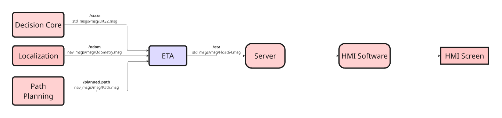
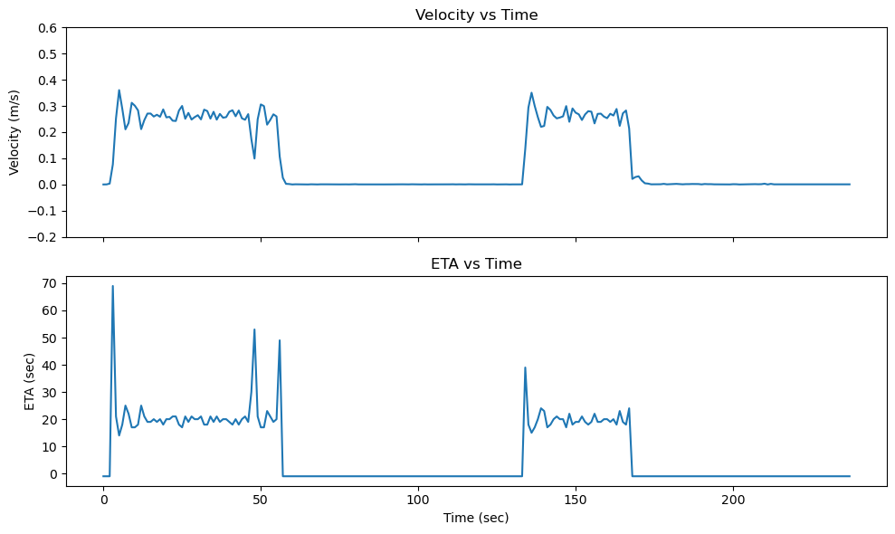
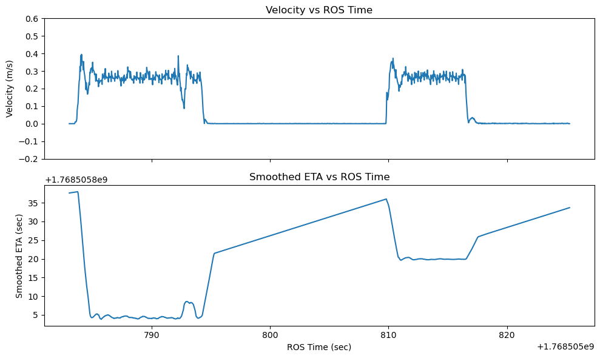

  <h1 style="font-size: 36px;">Feature: User can track the estimated time of arrival (ETA) in real time via the internal user interface</h1>

## Feature Owner: Surendrakumar Koganti

## 📚 Contents
- [Feature Overview](#feature-overview)
- [Gap Analysis](#gap-analysis)
- [Improvement](#improvement)
- [Test Strategy](#test-strategy)
- [Evaluation](#evaluation)

## Feature Overview
The ETA feature provides users with a real-time estimate of the shuttle’s arrival time at its destination in the internal user interface (after the user is boarded). This is calculated dynamically based on the shuttle’s current position and velocity (from /odom) and the planned path (from /planned_path). ETA updates are continuously published to the /eta topic as a float representing seconds since epoch.
 

**Key Performance Indicator (KPI):**
1.	ETA jump between 2 consecutive values should be less than 5 s
2.	During constant velocity (± 0.04 m/s), ETA should remain constant (± 2 s)
3.	Slope of ETA should be 1 during Red state of traffic light
4.	Throughout the journey from pickup to drop location, estimated ETA should not be deviated by more than ±15% of calculated ETA value (using constant velocity)

**Functionality / Properties:**
1. The ETA feature continuously calculates the estimated time of arrival (when user is inside the shuttle) based on the shuttle’s current position, velocity and its remaining distance to the destination (taking into account both the path already travelled and the planned path ahead).
2. ETA is dynamically adjusted whenever the shuttle stops, whether due to traffic lights, obstacles, or other temporary interruptions, ensuring that the user receives a realistic prediction of the arrival time under varying conditions.
3. To reduce sudden fluctuations caused by rapid changes in velocity or small positional updates, the feature implements a moving-average smoothing algorithm, which averages recent ETA values to provide a stable and easily interpretable estimate.
4. Additionally, the feature logs key information including the departure time, the current calculated ETA, the shuttle’s instantaneous velocity, and the index of the first remaining waypoint, which can be used for debugging, visualization, or integration with a user interface to give end-users continuous insight into the shuttle’s progress.

**Architecture**

 

Input:

    •	Decision Core (topic: /state) – current state of the state machine in shuttle (boarding, idle, driving, parking, etc.)
    •	Localization (topic: /odom ) - current x, y, orientation and velocity of car
    •	Path planning (topic: /planned_path) - planned waypoints from current location to destination

Output:

    •	ETA (topic: /eta) - ETA as seconds since epoch is sent to server (datatbase)

HMI Software fetches the data from database and shows ETA in the HMI Screen.

## Gap Analysis

Below ETA plot with respect to velocity is from M5 implementation:

 

Analysis with respect to MVP:
- ETA was shown in seconds in internal user interface (needs update)
- ETA computation was not able to handle temporary stop i.e 0 m/s (needs update)
- ETA is computed in all the vehicle states (needs update)
- ETA is fluctuating heavily even in straight path (needs update)

## Improvement

 

Below are the updates done as per the MVP:
- ETA is shown now in HH:MM:SS format with respect to the departure time.
- ETA computation can handle temporary stop by using minimum velocity (0.1 m/s) when the velocity becomes 0 m/s.
- ETA is computed only after the user is boarded.
- ETA is smoothened using rolling average filter over 30 samples.

## Test Strategy
**Test Basis:**

The test basis for validating the ETA feature is derived from:
- System requirements (Sys001–Sys006) defining the expected functional behaviour of ETA from the passenger and system perspective (system requirements can be found in [Test Specification](https://git.hs-coburg.de/pax_auto/pax_auto_main/src/branch/main/test/scenario_based_testing/feature_6/Template_AD_System_Test_Specification_%20EN.xlsx) document).
- Key Performance Indicators (KPIs) which provide quantitative acceptance criteria for ETA stability and correctness.
- Component interface definitions and boundary conditions (BC_ETA001 to BC_ETA007) which define the validity and assumptions of the inputs used for ETA computation.
Component interfaces: /odom, /planned_path, /state and /eta.
- Feature functional description, including the dynamic ETA computation, smoothing algorithm, and dependency on velocity and remaining path, which define the expected runtime behaviour of the feature.

**Boundary Conditions:**

    BC_ETA001: Car inside Model City Tracking Area
    The car shall be physically located inside the Model City area where the OptiTrack system provides valid pose to Localization component.
    Outside this area, pose estimation is not possible.
    Test implication: ETA behaviour outside the Model City is out of test scope.

    BC_ETA002: Valid Localization Output
    Localization shall publish valid /odom messages with:
    •	Finite position values (no NaN / Inf)
    •	Valid timestamps
    •	Continuous pose updates

    BC_ETA003: Velocity Source and Interpretation
    •	Vehicle velocity shall be taken from /odom.twist.twist.linear.
    •	The ETA component shall interpret velocity as longitudinal ground speed.

    BC_ETA004: Planned Path Availability
    •	A valid /planned_path must be received before ETA computation starts.
    •	The path shall contain:
        o	At least two waypoints
        o	Continuous geometry from current vehicle position to destination

    BC_ETA005: Path Consistency
    •	The planned path shall correspond to the current trip to the destination.
    •	Dynamic re-planning during the trip is out of scope. 

    BC_ETA006: Valid Driving State
    •	ETA calculation shall only be active when the car is:
        o	In Driving or Planning state after passenger boarding
    •	ETA shall not be calculated or displayed when the car is:
        o	Boarding
        o	Waiting for user authorization
        o	Idle without an active trip

    BC_ETA07: ETA Interpretation
    •	ETA is provided as a UNIX epoch timestamp.
    •	The user interface is responsible for formatting and displaying the ETA.

**Black-box Test Techniques:** Scenario-based testing on shuttle traveling in straight paths with temporary stop(variable velocity) and without temporary stop (with variable and constant velocity).

Scenario 1: 
- Shuttle driving from pickup location to drop location at variable velocity based on steering angle without any interruptions like traffic light or obstacle (Happy Path)
- Purpose: Validate ETA adaptability under realistic driving
- Test case: TC_ETA001 (can be found in [Test Specification](https://git.hs-coburg.de/pax_auto/pax_auto_main/src/branch/main/test/scenario_based_testing/feature_6/Template_AD_System_Test_Specification_%20EN.xlsx) document)

Scenario 2:
- Shuttle driving from pickup location to drop location in straight path at variable velocity based on steering angle with traffic light interruption
- Purpose: Validate ETA adaptability under realistic driving and interruption
- Test case: TC_ETA002 (can be found in [Test Specification](https://git.hs-coburg.de/pax_auto/pax_auto_main/src/branch/main/test/scenario_based_testing/feature_6/Template_AD_System_Test_Specification_%20EN.xlsx) document)

Scenario 3:
- Shuttle driving from pickup location to drop location in straight path at fixed velocity without any without any interruptions like traffic light or obstacle
- Purpose: Validate ETA accuracy under constant velocity
- Test case: TC_ETA003 (can be found in [Test Specification](https://git.hs-coburg.de/pax_auto/pax_auto_main/src/branch/main/test/scenario_based_testing/feature_6/Template_AD_System_Test_Specification_%20EN.xlsx) document)

**Test Coverage:**
Test coverage for the ETA feature is ensured across multiple areas:
- Requirement coverage: All system requirements Sys001–Sys006 are validated through defined scenarios and KPI checks.
- KPI coverage: All quantitative KPIs related to ETA stability, correctness, and accuracy are verified using recorded CSV data and plots.
- Scenario coverage: ETA behaviour is validated under variable velocity, constant velocity, and traffic interruption conditions from pickup to drop location in straight path.
- Interface coverage: All ETA inputs (/odom, /planned_path, /state) and output (/eta) are exercised during testing.
- Boundary condition coverage: All defined boundary conditions BC_ETA001 to BC_ETA007 are respected and validated within the test environment.

**Test Environment:** 

    •	Model City: 8 × 8 m
    •	Model Car
    •	Motion capture: OptiTrack
    •	ROS 2 system with following components:
        o	Localization 
        o	Path planner 
        o	Decision core 
        o	Trajectory controller
        o	ETA component
        o	HMI SW
        o	Server
    •	Traffic light manipulation 
    •	Data recording:
        o	ROS bag recording /odom, /eta, /planned_path, /state (manual recording is needed)
        o	CSV file with velocity, eta, current timestamp, departure time (already automated in the node)

## Evaluation
Detailed evaluation is documented in [Test Specification](https://git.hs-coburg.de/pax_auto/pax_auto_main/src/branch/main/test/scenario_based_testing/feature_6/Template_AD_System_Test_Specification_%20EN.xlsx) document.
